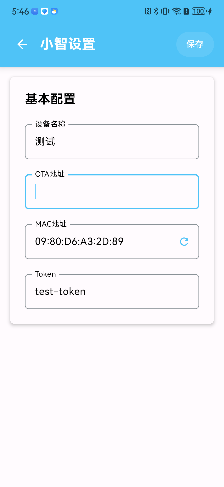

# 小智AI Android客户端

一个基于小智的Android智能语音对话应用。

## 📱 功能特性

- **文本交互**: 支持文本输入和显示
- **多轮对话**: 支持自动和手动两种对话模式
- **WebSocket通信**: 基于WebSocket的实时双向通信
- **状态管理**: 完整的对话状态流转和错误处理

## 📸 应用截图

### 应用界面展示

  
  

## 使用说明

在设置中配置OTA地址，通过OTA下发的验证码与后端绑定激活，激活成功后，即可进行对话。

OTA地址可使用小智官方地址：  
https://api.tenclass.net/xiaozhi/ota/

也可自行搭建后端服务：  
[https://github.com/xinnan-tech/xiaozhi-esp32-server](xiaozhi-esp32-server)

## 📚 文档

- [详细介绍](./doc/description.md) - 项目的详细介绍
- [API通信协议](./doc/api.md) - WebSocket通信协议详细说明
- [对话流程](./doc/flow.md) - 对话流程实现和状态管理
- [MCP协议](./doc/mcp.md) - MCP工具调用协议
- [OTA接口文档](./doc/OTA%20接口文档.pdf) - OTA接口文档